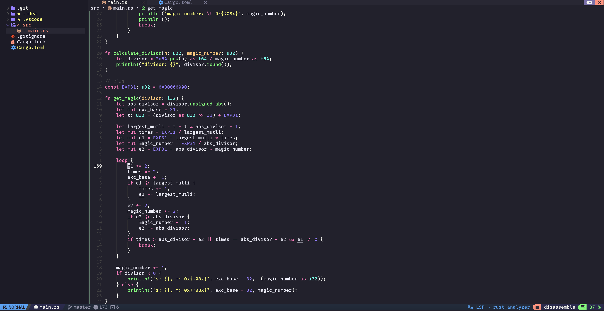

## nvim-config

### 介绍

Neovim配置文件 v2.x

由于社区插件更新速度太快，导致配置文件过时的情况经常发生，维护起来比较费时费力。
因此由第一版全部定制化，改为基于NvChad进行二次配置。

现可在Windows上正常运行。使用lazy.nvim对插件进行懒加载，提高启动速度。

### 截图

定制主题，基于dracula配色方案，有待改进



修改了大部分快捷键


### 安装教程

这里以Windows为例，其它系统安装更加简单，可以作为参考。

先安装neovim，由于用到了inlay-hints新特性，需要使用Pre-Release每夜构建版，下载地址：https://github.com/neovim/neovim/releases
选择`nvim-win64.zip`，解压/移动后添加到环境变量。

安装clipboard-tool，用于使用系统剪贴板。
```
winget install win32yank
```

安装ripgrep，用于快速搜索文件内容。
```
winget install BurntSushi.ripgrep.GNU
```
或者下载压缩包：https://github.com/BurntSushi/ripgrep/releases
选择`ripgrep-x.x.x-x86_64-pc-windows-gnu.zip`，解压/移动后添加到环境变量。

通过MinGW安装gcc等工具，地址：https://github.com/mstorsjo/llvm-mingw/releases
选择`llvm-mingw-yyyymmdd-ucrt-x86_64.zip`，解压/移动后添加到环境变量。

通过GnuWin32安装make等工具，地址：https://sourceforge.net/projects/getgnuwin32/files/
选择`GetGnuWin32_legacy_install_archive.zip`，解压/移动后添加到环境变量。

都安装好后，打开neovim，输入`:checkhealth`，确保除了缺少用户配置文件和各种语言providers的警告，没有其它错误。

克隆配置文件
```powershell
git clone https://github.com/uforever/neovim-config $ENV:USERPROFILE\AppData\Local\nvim
```
或
```shell
git clone https://github.com/uforever/neovim-config ~/.config/nvim
```

运行 `nvim` 自动安装插件

手动更新插件 `:Lazy sync`

使用Mason安装lua-language-server和stylua `:MasonInstallAll`

### TreeSitter配置

`:TSInstallInfo` 查看可用语言

`:TSInstall <LANGUAGE>` 安装某个可用语言的parser

也可以在`lua/configs/treesitter.lua`中配置


### LSP配置

大部分包建议手动安装，而不是使用mason

参考：
https://github.com/neovim/nvim-lspconfig/blob/master/doc/server_configurations.md
和
https://github.com/helix-editor/helix/wiki/Language-Server-Configurations

默认支持lua、c、html、css、javascript、json、typescript、python和rust，
如果需要其它语言可以参考：先安装对应的LSP，然后配置`lua/configs/lspconfig.lua`和`lua/configs/conform.lua`

- lua(`lua-ls stylua`)

`:MasonInstallAll`

- html(`html`)、css(`cssls`)、json(`jsonls`)

```
npm i -g vscode-langservers-extracted
```

- javascript、typescript(`tsserver`)

```
npm install -g typescript typescript-language-server
```

- python(`pyright ruff-lsp`)

```
npm install -g pyright
```

`:MasonInstall ruff-lsp`

- c(`clangd`)
地址：`https://github.com/llvm/llvm-project/releases`
选择：`LLVM-x.x.x-win64.exe`

- rust(`rust-analyzer`)

```
rustup component add rust-analyzer
```
